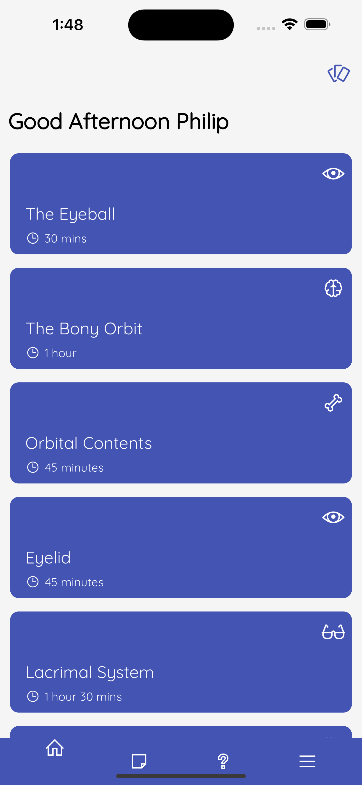
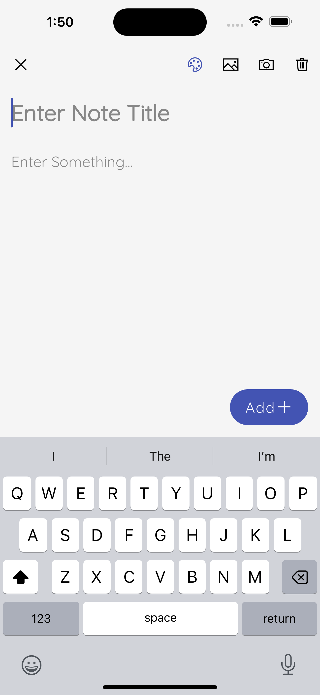
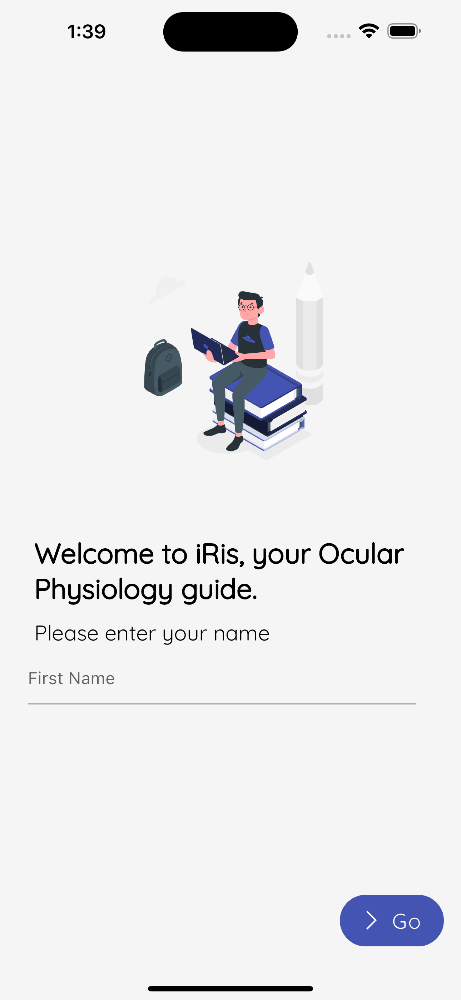
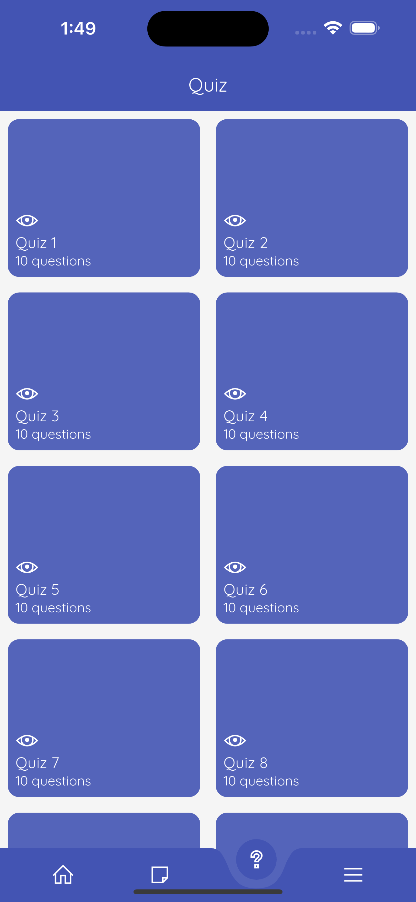
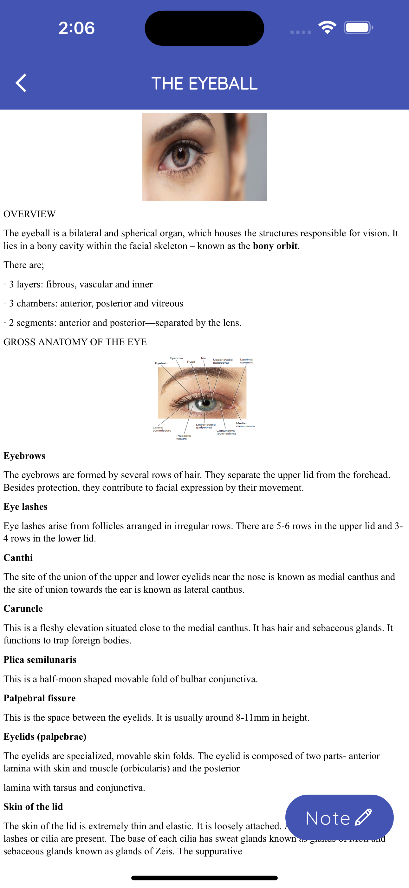
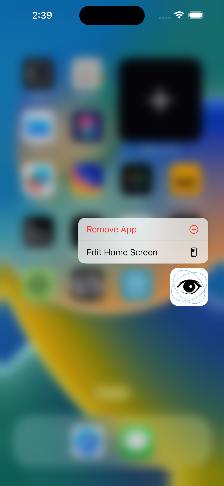
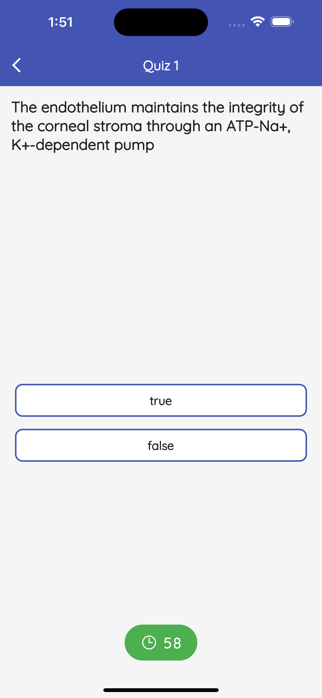
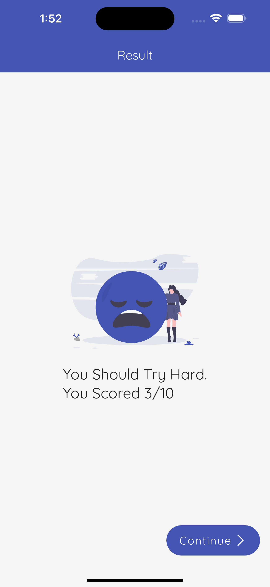

# Iris(Instant resourse instant results)

A simple educational app which contains notes taking,flash cards,quizes and educational resourse materials for Ocular Physiology.

*This mobile app was built in early 2021 as part of a group assignment in school*

#### Showcase
| Homepage | | Add notes Page |
| :---: | --- | :---: |
|  ||  |
| Simple homepage layout that lists   notes created by user || Adding a new note   it asks for title and notes |

| Onboard | | Quiz Page |
| :---: | --- | :---: |
|  ||  |
| Simple onboarding page to   tell you about the app|| A collection of quizes   the user can answer |

| Course page | | Preiew |
| :---: | --- | :---: |
|  ||  |
| Course details page which uses the    webview package locally|| A little preview of the app  |

| Quiz Page | | Quiz Result |
| :---: | --- | :---: |
|  ||  |
| An example of true/false type quiz   there are multiple choice questions too|| A quiz result page    that have good interactions and ux |

#### Download the APK
- [Iris App Apk](https://drive.google.com/file/d/1gL7s_bCo3x6Qxi_C9KaAmzIomC7snGc5/view?usp=sharing)

#### Framework
Iris App is built with the **Flutter SDK** in the **Dart** programming language. This allows Iris App to be deployed on multiple platforms with the same codebase and minimal platform setup.

#### Backend
The app is powered by Sqflite and everything is stored locally.

#### Illustrations

Most of the illustrations are from a website i discovered (https://undraw.co/) .

#### UI/UX

Took some inspiration from pinterest but basically built out the ui all by myself 😌 .

##### P.S.
Feel free to clone and mess around. Pull requests are welcome. There's a lot of data from the backend that isn't being used as per the requirements of the challenge but they can make the app's UI richer.Plus its pretty old code so it may mess up a bit 😅

## Getting Started

This project is a starting point for a Flutter application.

A few resources to get you started if this is your first Flutter project:

- [Lab: Write your first Flutter app](https://docs.flutter.dev/get-started/codelab)
- [Cookbook: Useful Flutter samples](https://docs.flutter.dev/cookbook)

For help getting started with Flutter development, view the
[online documentation](https://docs.flutter.dev/), which offers tutorials,
samples, guidance on mobile development, and a full API reference.
